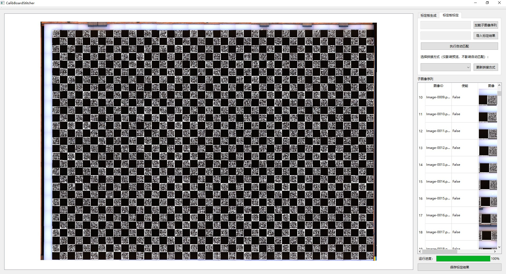

# CalibBoardStitcherUI
标定板拼接工具([h13-0/CalibBoardStitcher](https://github.com/h13-0/CalibBoardStitcher))的前端UI。

## 二次开发
二次开发可见：[h13-0/CalibBoardStitcher](https://github.com/h13-0/CalibBoardStitcher)

## 软件功能
- [x] 标定板生成
- [x] 子图标定与拼接
- [x] 拼接结果微调
  - [x] 主视图中修改标定点
  - [ ] 增删标定点
  - [ ] 右侧列表中手动添加未自动匹配的图像

## 软件使用流程
1. 进入 `标定板生成` 页面，根据需要生成指定参数的标定板
2. 采集若干子图像，并按需为子图像进行重命名，可见附注 `使用技巧——图像id` 
3. 进入 `标定板标定` 页面，点击 `加载子图像序列` 按钮，选定子图像所在文件夹
4. 点击 `执行自动匹配` 按钮，进行预匹配
5. 在左侧主图像中检查拼接结果，使用如下方法之一微调匹配点
    1. 双击主图像中需要微调的图像，手动调节锚点(已完成)
    2. 右侧列表中双击图像，手动添加图像或调节锚点(未完成)
6. 导出拼接结果(`*.json`文件)
7. 按照如下二次开发方式进行开发

## 附注
### 使用技巧——图像id
本软件在 `软件使用流程` 的步骤3导入子图像序列时，会将图像名作为图像id; 而后该图像id会始终保持于步骤6、7的导出拼接结果和二次开发中。
因此建议在使用本软件标注前，可以自行将子图像文件重命名为有意义的格式，例如： `${行id}_${列id}.jpg` 等。随后在进行二次开发时可以直接依照 `${行id}_${列id}.jpg` 的格式指定传入图像的id。

### 使用技巧——精度提升

